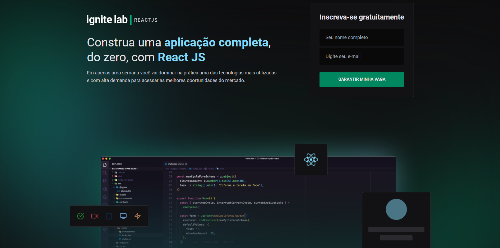
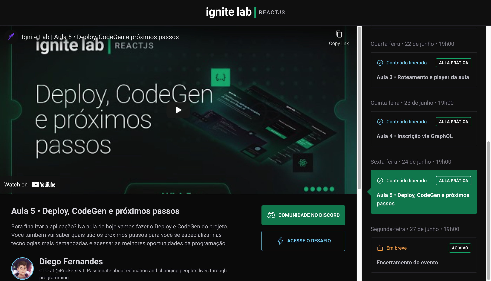

# Plataforma de evento &ndash; Ignite Lab React

Essa aplicação consiste em uma plataforma de evento para o Ignite Lab de React, construída durante o próprio evento! 🤯

Link da plataforma <https://event-platform-ignite-lab-green.vercel.app/>

O evento contém uma série de aulas criando uma aplicação do zero com algumas das tecnologias mais requisitadas do mercado na área de front-end, sendo a principal delas o **React**.

Nessa plataforma os que desejarem participar podem se inscrever no evento usando seu e-mail (e futuramente eu vou trocar pra usar o GitHub), sendo então redirecionados à página da primeira aula, onde também estão presentes as demais aulas.

Por se tratar de um evento, as aulas são liberadas dia após dia, então todas as aulas do evento tem uma data e horário de lançamento, assim cada aula só pode ser acessada a partir de um momento específico.

A plataforma utiliza o **GraphCMS** para guardar as informações das aulas, como título, descrição, professor, data de lançamento etc. Como o próprio nome do CMS sugere, ele disponibiliza uma API **GraphQL** e, por conseguinte, utilizamos o **Apollo Client** para realizar as requisições ao CMS.

Além disso, a aplicação é totalmente responsiva e toda a estilização foi feita utilizando o framework **TailwindCSS**.

## Tecnologias/serviços utilizados

- React.js
- Vite
- TypeScript
- TailwindCSS
- GraphQL
- Apollo Client
- GraphCMS